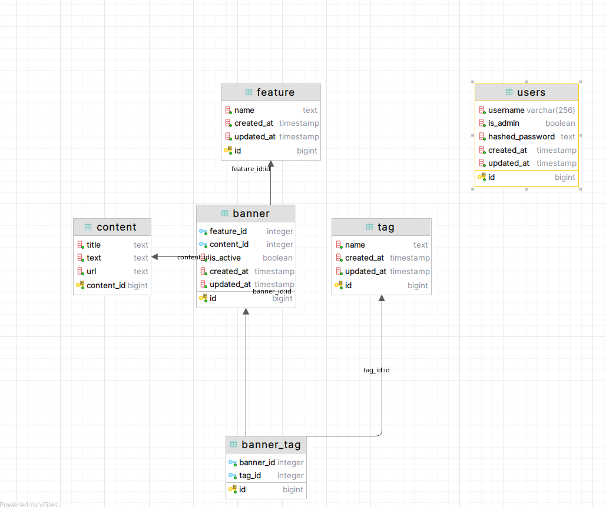

## Avito backend trainee 2024 assignment

## Запуск

Для запуска необходимо выполнить команду
```shell
make run
```

после чего создадутся и запустятся два Docker контейнера, один с базой данных Postgres, 
другой с самим приложением.

В базе данных уже будут присутствовать некоторые данные, например
будет существовать учетная запись админа:

```yaml
  username: admin
  password: 12345678
```

так же будут существовать теги и фичи со следующими id:

```yaml
tags:
  - id: 1
  - id: 2

features: 
  - id: 1
  - id: 2
```

Для запуска интеграционных тестов необходимо выполнить команду
```shell
make test.integration
```


## Ход решения

По поводу структуры базы данных: в задании написано,  
что banner - объект неопределенной структуры, отсюда неясно, что этот объект по своей природе неопределенной структуры
(она способна изменяться) или выполняющему необходимо самому придумать эту структуру. Я принял второй вариант.

### Структура БД следующая:
<p>
 
</p>

### Связь баннера и тегов

В задании написано:
- Один баннер может быть связан только с одной фичей и несколькими тегами
- При этом один тег, как и одна фича, могут принадлежать разным баннерам одновременно
- Фича и тег однозначно определяют баннер

В этих пунктах есть противоречие с тем, что баннер может быть связан с несколькими тегами, 
но, при этом, фича и тег однозначно определяют баннер.  
**Интерпретирую это так: _фича и набор тегов однозначно определяют баннер_.**

### API

- В приведенной openapi спецификации метод **[GET] /user_banner**
принимает на вход **tag_id**, хотя по одному тегу нельзя однозначно определить баннер.  
Поэтому я изменил сигнатуру метода и на вход принимаю **tag_ids** в качестве списка.

